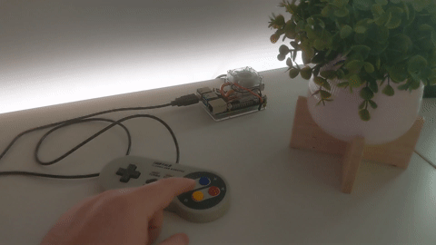

# homeassistant-gamepad
Toggle a home assistant input using a USB gamepad.

It uses [evdev](https://python-evdev.readthedocs.io) to read Linux input devices, and [homeassistant-api](https://homeassistantapi.readthedocs.io/en/latest/) to toggle a group of lights in home assistant.

## Basic Usage

Build the docker image

    docker build . -t homeassistant-gamepad

Create and set your access token, from your Profile -> Long-Lived Access Tokens -> Create Token

    export HOMEASSISTANT_TOKEN=...

Run the docker image

    docker run --rm -it \
      --device=/dev/input/event0 \
      -e HOMEASSISTANT_TOKEN \
      -e HOMEASSISTANT_URL=http://192.168.1.8:8123/api \
      -e HOMEASSISTANT_ENTITY=light.office_lights \
      -e INPUT_DEVICE=/dev/input/event0 \
      homeassistant-gamepad

> **Note:** If you have exported the environment variable `HOMEASSISTANT_TOKEN` for your current user, and are using `sudo` to run docker, you may need to preserve environment variables with `sudo -E`.

## Docker Compose

    version: '3'
    services:
    homeassistant-gamepad:
        build: .
        devices:
            - /dev/input/event0
        restart: unless-stopped
        environment:
            - HOMEASSISTANT_TOKEN
            - HOMEASSISTANT_URL=http://127.0.0.1:8123/api
            - HOMEASSISTANT_ENTITY=light.office_lights
            - INPUT_DEVICE=/dev/input/event0

This assumes you have set `HOMEASSISTANT_TOKEN` in your current shell.